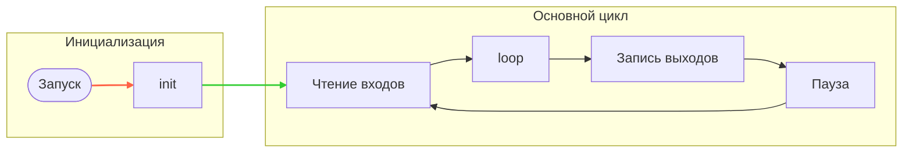

---
hide:
  - toc
---
# Исполнение программы
## Что такое Runtime?
Runtime-система платформы <span style="display: inline-block; position: relative;">LC<span style="position: relative; top: -0.25em;">2</span></span> (или просто Runtime) — это встроенная часть среды выполнения, которая управляет циклическим исполнением программы и взаимодействием с физическими входами/выходами контроллера.


## Исполнение программы
Алгоритм работы Runtime показан на блок-схеме ниже:


## Этапы выполнения  

### **1. Инициализация `init()`**  
После запуска программы Runtime вызывает функцию `init()`. Она вызывается один раз и используется для инициализации переменных, состояния устройства или запуска фоновых процессов.
```cs
void init()
{
  // Код инициализации
}
```

### **2. Основной цикл**  
После завершения `init()` начинается непрерывный цикл исполнения, который состоит из следующих этапов:  

- **Чтение входов**  
Перед вызовом функции `loop()`, Runtime считывает состояния всех аппаратных входов (например, дискретных или аналоговых) и сохраняет их в соответствующие Input-переменные. Значения всех Input-переменных обновляются в начале каждой итерации основного цикла, перед вызовом `loop()`. Во время выполнения `loop()` эти значения остаются неизменными, независимо от дальнейших изменений на физических входах.  
- **Вызов `loop()`**  
Функция `loop()` содержит основную логику обработки. В её пределах выполняется работа с переменными, анализ значений входных сигналов и установка выходных значений.
```cs
void loop()
{
  // Логика обработки
}
```
- **Запись выходов**  
Установка физических выходов производится только после завершения выполнения функции loop().
Все изменения Output-переменных, выполняемые внутри loop(), не приводят к немедленному изменению состояния аппаратных выходов. Эти значения сохраняются во временных переменных и применяются к выходам автоматически после выхода из loop().
- **Пауза**
После установки выходов происходит задержка, которая определяет частоту основного цикла. Длительность паузы вычисляется автоматически, чтобы обеспечить стабильный период исполнения. Если вся итерация (**чтение входов → loop() → запись выходов**) заняла больше времени, чем задано — новый цикл начнётся сразу, без паузы.
