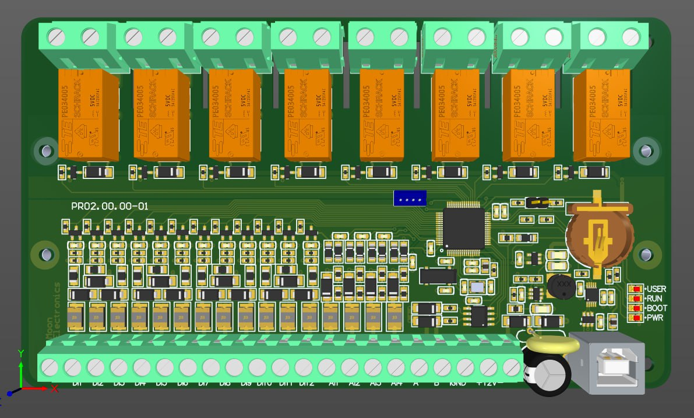

---
hide:
  - toc
---
# Обзор контроллера

**Технические характеристики программируемого реле ALPHA-12.1208.01**:  

- Питание 8..24 В;
- Потребляемая пиковая мощность 5 Вт, при всех отключенных реле менее 1 Вт;
- 8 релейных выходов;
- 12 дискретных входов, уровень срабатывания 6 вольт, максимальное напряжение 24 вольта;
- 4 аналоговых входа 0..18В, разрешение 12 бит, входное сопротивление 61 кОм;
- RS485 (поддержка пока не реализована, будет Modbus Slave);
- RTC с календарем и батарейкой для поддержания хода часов;
- Пользовательский светодиод;
- Отладочный интерфейс USB;
- Память программ 56 КБ;
- Память данных 1 КБ.

**Файл конфигурации**:

- <a href="/quickstart/alpha-1208-01.xml" download>alpha-1208-01.xml</a>

(более свежая картинка будет вставлена позже)
