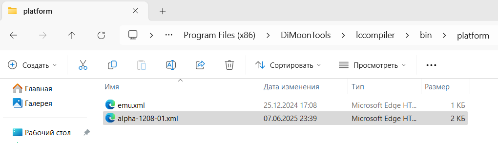

---
hide:
  - toc
---
# Добавляем поддержку контроллера **ALPHA-12.1208.01**
Следующий шаг - выполнить компиляцию проекта под конкретную платформу, а именно для программируемое реле **ALPHA-12.1208.01**, речь о котором пойдет далее.  
Для добавленя поддержки компиляции под данный контроллер, в папку с компилятором необходимо добавить файл конфигурации для данного программируемого реле. Для этого:  

- Открываем папку **platform** с файлами конфигурации, на 64-х битных Windows она расположена здесь: **C:\Program Files (x86)\DiMoonTools\lccompiler\bin\platform**;
- скачиваем файл конфигурации, в нашем случае это <a href="/quickstart/alpha-1208-01.xml" download>alpha-1208-01.xml</a>; 
- кладем файл конфигурации в папку **platform**:
  

