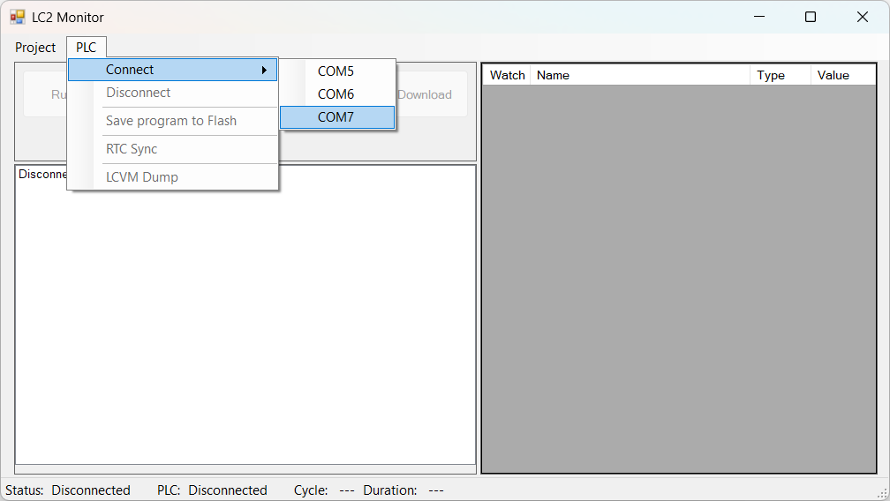
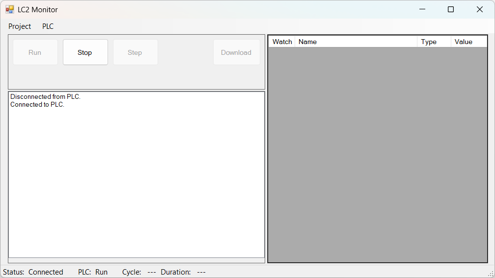

---
hide:
  - toc
---
# Подключение к контроллеру

Подключение к контроллеру пока поддерживается только через интерфейс USB-UART. При подключении контроллера к ПК, он должен определиться в системе как COM-порт, в данном случае это `COM7`.  
Для выполнения подключения, выбираем `PLC`→`Connect`→`COM7`:  

  

В случае успеха появится сообщение `Connected to PLC`:  

  

В таком состоянии мы можем запускать и останавливать ранее загруженную в контроллер программу, а также выполнять синхронизацию RTC контроллера.