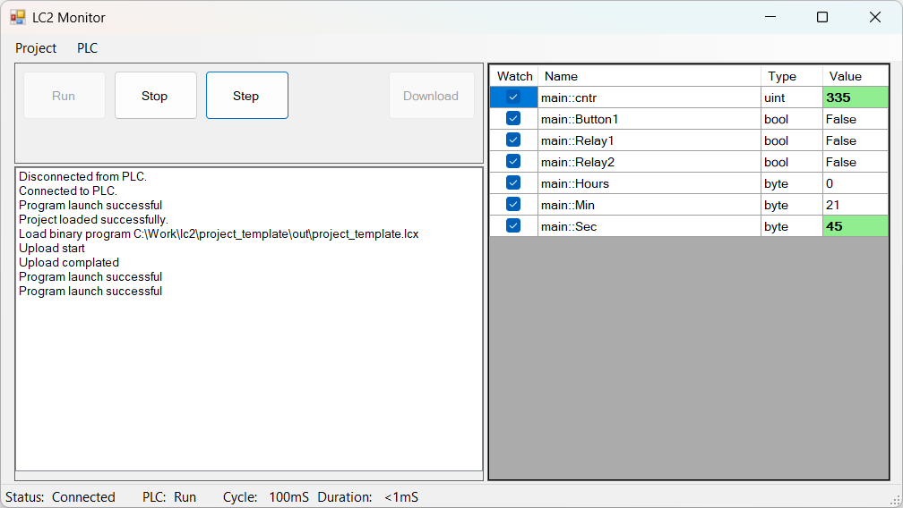
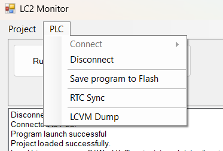

---
hide:
  - toc
---
# Обзор LC2 Monitor
LC2 Monitor служит для следующих целей:  

- Загрузка скомпилированного проекта в контроллер;
- Управление исполнением проекта (Пуск/Стоп/Шаг);
- Мониторинг значений переменных проекта;
- Получение информации об ошибках выполнения;
- Синхронизация RTC контроллера с часами ПК.

В LC2 пока реализованы минимальные отладочные возможности, которые включают в себя сделующее:  

- Просмотр значений переменных проекта в реальном времени;
- Выполнение цикла `loop()` один раз с последующим переходом контроллера в состояние паузы. Это позволяет выполнять анализ состояния программы и переменных проекта в статичном режиме.

## Обзор интерфейса программы

Для управления состоянием выполнения пользовательского приложения на LC, служат кнопки `Run`, `Stop` и `Step`:  

- `Run` - запуск программы на выполнение
- `Stop` - останов выполнения программы
- `Step` - выполнить один цикл функции `loop()` и перейти в состояния паузы. Для выполнения еще одного цикла, необходимо нажать `Step` еще раз. Для перехода в режим нормальной работы, нужно нажать `Run`.

Кнопка `Download` выполняет загрузку бинарника в память контроллера. Это необходимо сделать после перекомпиляции приложения и перед запуском кнопкой `Run`.  

В строке состояния имеются следующие элементы:  

- `Status` - текущее состояние подключения к контроллеру;
- `PLC` - состояние Runtime контроллера (`Run`, `Stop`, `Pause`);
- `Cycle` - установленное значение периода вызова функции `loop()`;
- `Duration` - длительность выполнения одного цикла.

В правой части можно наблюдать окно состояния переменных проекта:  

- `Watch` - если стоит галочка, то значение переменной будет обновляться автоматически раз в 1 сек.;
- `Name` - имя переменной проекта и имя программного модуля, в котором размещена переменная;
- `Type` - тип переменной;
- `Value` - значение переменной. С помощью этого поля можно в том числе изменить значение переменной. Для этого нужно выделить значение интересующей переменной, и выполнить по нему двойной клик левой кнопкой мыши. После внесения изменения, нужно нажать `Enter`. 

## Меню **PLC**

Данное меню включает следующие пункты:  

- `Connect` - выполнить подключение к контроллеру;
- `Disconnect` - закрыть подключение;
- `Save program to Flash` - выполняет сохранение текущей программы в энергонезависимую память. При следующем включении питания, последняя сохраненная программа будет автоматически загружена и запущена на выполнение. Это действие можно выполнить в состоянии `Stop`; 
- `RTC Sync` -  выполняет синхронизацию RTC контроллера с часами ПК;
- `LCVM Dump` - отображает состояние виртуальной машины LCVM. Это полезно для анализа Runtime-ошибкок выполнения программы.

