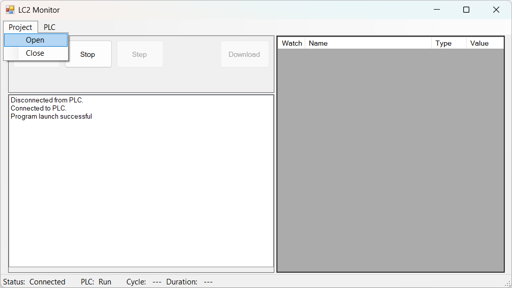
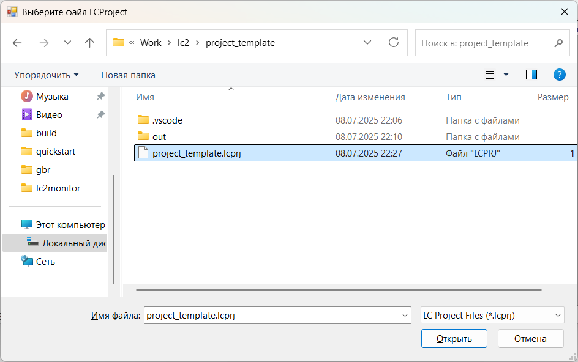
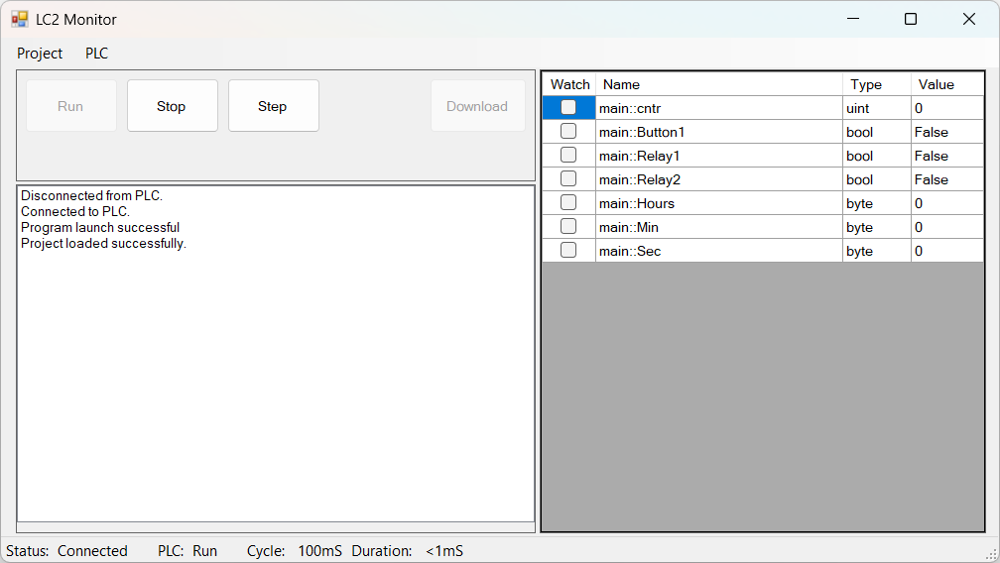

---
hide:
  - toc
---

# Загрузка проекта

Для выполнения отладки, необходимо загрузить проект и отладочные символы в LC2 Monitor. Для этого выполняем `Project`→`Open`, и в открывшемся окне выбираем файл проекта (файл с расширением `.lcprj`):

  
  

После выполнения этих действий, проект загружается в LC2 Monitor. В правой части окна можно наблюдать все переменные проекта:  

