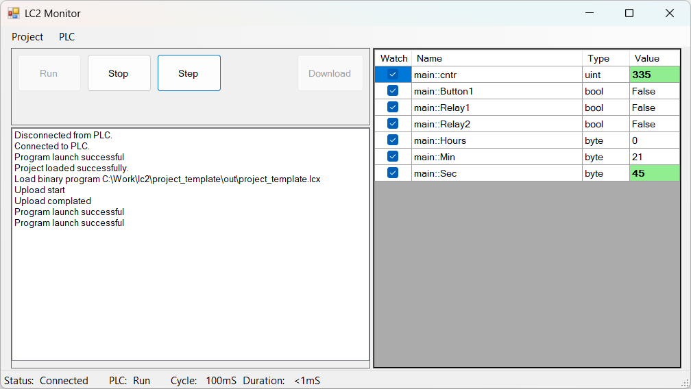

---
hide:
  - toc
---

# Запуск проекта
Для запуска проекта, нужно произвести сделующие действия:  

- Если контроллер не находится в режиме `Stop`, необходимо остановить его нажатием на кнопку `Stop`;
- После этого, выполняем загрузку скомпилированного бинарника в контроллер нажатием на кнопку `Download`;
- Затем, для запуска бинарника, нажимаем на кнопку `Run`;
- Для обновления значений переменных проекта в реальном времени, необходимо проставить галочки напротив интересующих переменных (колонка `Watch` в правой части окна). 

❗Если переменных слишком много (например, несколько сотен), и интерфейс программы начинает "тормозить", то снимите галочки с переменных, значения которых в данный момент не представляет интерес.  

