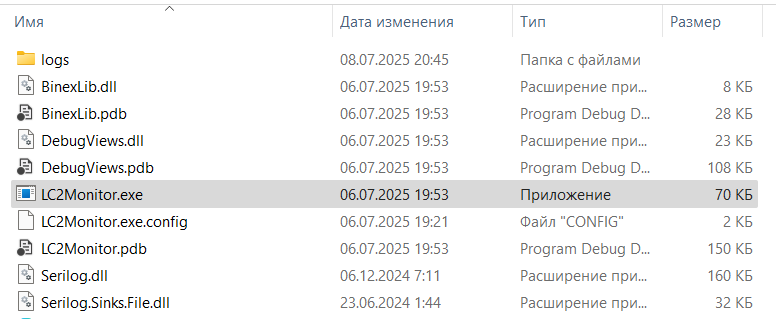

---
hide:
  - toc
---

# Установка LC2 Monitor

Актуальные версии программного обеспечения можно найти [на странице загрузок](/downloads/).  
Для работы всего программного обеспечения из пакета LC2, необходимо скачать и установить **.NET Framework 4.7.2**, ссылка на скачивание с сайта Microsoft: [https://dotnet.microsoft.com/en-us/download/dotnet-framework/thank-you/net472-offline-installer](https://dotnet.microsoft.com/en-us/download/dotnet-framework/thank-you/net472-offline-installer).

## Установка

Данная утилита не требует установки, достаточно скачать архив с программой, распаковать его в любой каталог, и запустить **LC2Monitor.exe**:  
  

### Примечание
Так как утилита не подписана сертификатом, при запуске утилиты может возникнуть окно безопасности SmartScreen. Для продолженя запуска необходимо нажать на "**Подробнее**", а затем "**Выполнить в любом случае**".