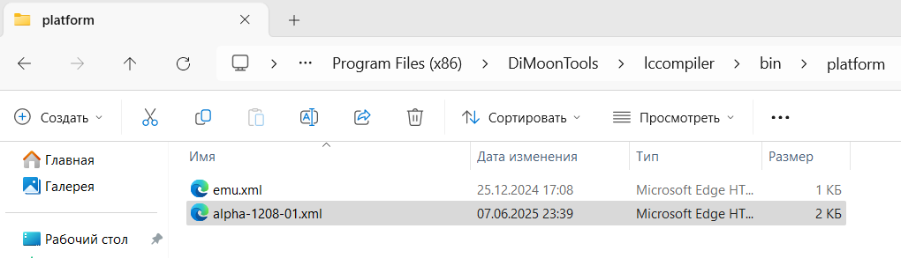

---
hide:
  - toc
---
# Компиляция в VS Code

## Компилируем тестовый проект

- Скачиваем **шаблон проекта** [со страницы загрузок](/downloads/)
- Распаковываем архив в любую папку
- Открываем проект как папку в VS Code (**Open Folder**), в результате получаем такой результат:  
  


 - Пробуем скомпилировать тестовый проект, для этого выбираем *Terminal*→*Run Task...*→*Compile*, или используем комбинацию `Ctrl+Shift+B`. В случае успеха, в терминале должно появиться следующее:
```bash
main.lc:14:11:14:12:Info:Константное значение '1' преобразовано из типа 'sbyte' в 'int'
main.lc:15:11:15:12:Info:Константное значение '2' преобразовано из типа 'sbyte' в 'int'

Компиляция выполнена успешно
Размер исполняемого кода: 95 байт
Размер исполняемого файла: 130 байт
Выделено ОЗУ в статической области: 0 байт
```

## Изменяем целевую платформу
Следующий шаг - выполнить компиляцию проекта под конкретную платформу, а именно для программируемое реле **ALPHA-12.1208.01**, речь о котором пойдет далее.  

### Добавляем в компилятор новую платформу
Для добавленя поддержки компиляции под данный контроллер, в папку с компилятором необходимо добавить файл конфигурации для данного программируемого реле. Для этого:  

- Открываем папку **platform** с файлами конфигурации, на 64-х битных Windows она расположена здесь: **C:\Program Files (x86)\DiMoonTools\lccompiler\bin\platform**;
- скачиваем файл конфигурации, в нашем случае это <a href="../alpha-1208-01.xml" download>alpha-1208-01.xml</a>; 
- кладем файл конфигурации в папку **platform**:
  


### Редактируем шаблон проекта

После этого, возвращаемя в VS Code. Здесь:  

- Открываем в текстовом редакторе файл проекта **project_template.lcprj** 
- Находим строку:
```xml
<platform>emu</platform>
```
и заменяем `emu` на `alpha-1208-01`:
```xml
<platform>alpha-1208-01</platform>
```
- В результате XML-файл проекта должен выглядет вот так:
```xml
<?xml version="1.0" encoding="utf-8"?>
<project>
  <platform>alpha-1208-01</platform>
  <source>
    <file>main.lc</file>
  </source>
  <outputdir>out</outputdir>
</project>
```
- После этого сохраняем этот файл, и пробуем скомпилировать проект еще раз. Если все прошло успешно, то платформа измена успешно, теперь этот проект будет компилироваться под **alpha-1208-01**.  

### Проверяем результат

Для проверки, можем попробовать заиспользовать ресурсы, которые присутствуют в нашем программируемом реле. Для этого:  

- Открываем файл `main.lc`
- Удаляем из него все содержимое, и копируем вот это:
```cs
bool Button1 @ "DI.1"; // Вход кнопки
bool Relay1 @ "DO.1"; // Выход реле 1
bool Relay2 @ "DO.2"; // Выход реле 2

//Привязка RTC к переменным проекта
byte Hours @ "RTC.HOUR";
byte Min @ "RTC.MIN";
byte Sec @ "RTC.SEC";

uint cntr = 0; //Счетчик циклов, для отладки

//Функция инициализации, вызывается один раз при запуске программы
void init()
{
  _CYCLE((ushort)100); // Вызов loop() каждые 100 мс
}

void loop() 
{
  if (Button1) 
    Relay1 = true; // Включить реле при нажатии кнопки
  else 
    Relay1 = false; // Выключить реле

  //Реле 2 включается в 12:00:00
  if(Hours == 12 && Min == 0 && Sec == 0)
    Relay2 = true;
  else
    Relay2 = false;

  cntr++;
}
``` 
- Сохраняем файл, и выполняем компиляцию проекта. В результате, в терминал VS Code должно быть выведено нечто подобное:
```bat
Executing task: lccompiler.exe project_template.lcprj -ast 

main.lc:10:13:10:14:Info:Константное значение '0' преобразовано из типа 'sbyte' в 'uint'
main.lc:26:15:26:17:Info:Константное значение '12' преобразовано из типа 'sbyte' в 'byte'
main.lc:26:28:26:29:Info:Константное значение '0' преобразовано из типа 'sbyte' в 'byte'
main.lc:26:40:26:41:Info:Константное значение '0' преобразовано из типа 'sbyte' в 'byte'
Созданы ссылки на следующие I/O переменные
DI.1
DO.1
DO.2
RTC.HOUR
RTC.MIN
RTC.SEC

Компиляция выполнена успешно
Размер исполняемого кода: 131 байт
Размер исполняемого файла: 202 байт
Выделено ОЗУ в статической области: 10 байт
```
### Выводы
Если получилось успешно повторить всё из этого раздела, то поздравляю вас с успехом, вам удалось правильно установить компилятор <span style="display: inline-block; position: relative;">LC<span style="position: relative; top: -0.25em;">2</span></span>, вы научились добавлять поддержку нового контроллера, и копмилировать проект на языке LC!  
На данном этапе развития проекта, пользоваться инструментами разработки не совсем удобно, однако, в дальнейшем планируется улучшить пользовательский опыт программирования на LC!

## Если что-то пошло не так

- Если в консоль VS Code было выведено что-то подобное:
```bat
Executing task: lccompiler.exe project_template.lcprj -ast 

lccompiler.exe : Имя "lccompiler.exe" не распознано как имя командлета, функции, файла сценария или выполняемой программы. Проверьте прав
ильность написания имени, а также наличие и правильность пути, после чего повторите попытку.
строка:1 знак:1
+ lccompiler.exe project_template.lcprj -ast
+ ~~~~~~~~~~~~~~~
    + CategoryInfo          : ObjectNotFound: (lccompiler.exe:String) [], CommandNotFoundException
    + FullyQualifiedErrorId : CommandNotFoundException
```
это означает, что VS Code не смог найти путь к компилятору `lccompiler.exe`. Для начала убедитесь, что компилятор `LCCompiler` действительно установлен, и после установки была произведена перезагрузка ПК. После этого, откройте командную строку Winfows, и введите  `lccompiler.exe`. Если все хорошо, то вывод должен быть таким:
```bat
C:\Users\USER>lccompiler.exe
Формат командной строки: lcc PROJ_FILE.lcprj

C:\Users\USER>
```
- Перекачайте архив шаблона проекта, возможно, конфигурационные файлы шаблона повреждены. После этого попробуйте собрать проект еще раз.
- Если компилятор установлен и откликается из командной строки, однако, в VS Code не удается собрать проект, попробуйте это сделать из командной строки. Для этого откройте `cmd`, перейдите в папку с проектом, и выполните компиляцию вручную:
```bat
C:\Users\USER>cd C:\Work\lc2\lccompiler\MISC\project_template

C:\Work\lc2\lccompiler\MISC\project_template>lccompiler.exe project_template.lcprj
main.lc:14:11:14:12:Info:Константное значение '1' преобразовано из типа 'sbyte' в 'int'
main.lc:15:11:15:12:Info:Константное значение '2' преобразовано из типа 'sbyte' в 'int'

Компиляция выполнена успешно
Размер исполняемого кода: 95 байт
Размер исполняемого файла: 130 байт
Выделено ОЗУ в статической области: 0 байт

C:\Work\lc2\lccompiler\MISC\project_template>
```